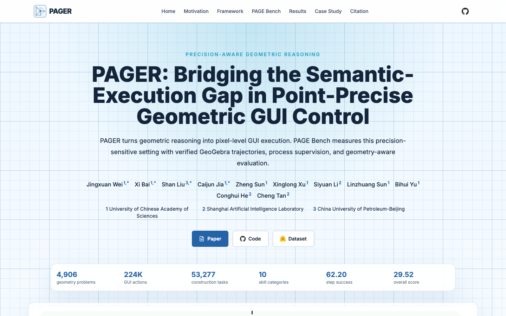
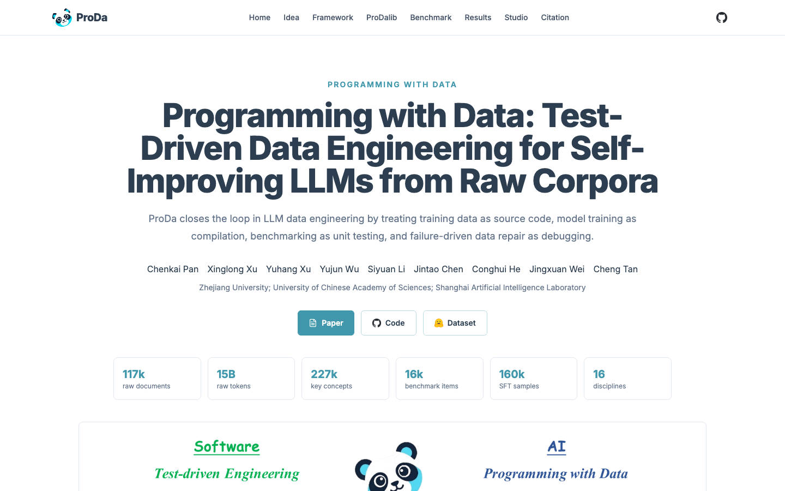
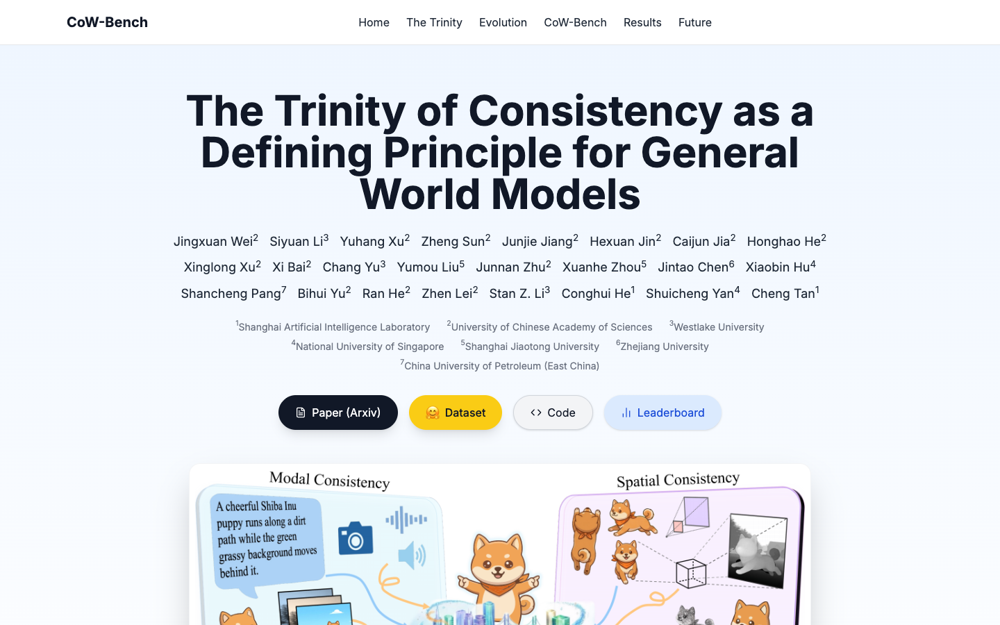
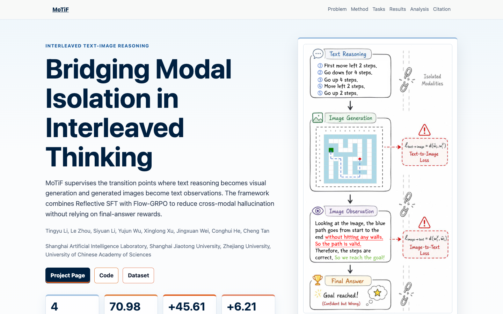

# paper-webpage-builder


把论文项目变成一个可发布的单页项目主页。

这个 Skill 给 Codex/Claude Code 这类 agent 使用。用户从 Overleaf 下载论文源码包或 PDF 后，把文件夹交给 agent，agent 会读取论文内容、整理图表和链接，生成一个完整的 `index.html` 项目主页，并做基础验证。

## 示例项目

这些项目主页都来自这个 Skill 的实际生成或迭代流程：

| <div align="center"><strong><a href="https://openraiser.github.io/Pager/">PAGER</a></strong></div> | <div align="center"><strong><a href="https://openraiser.github.io/ProDa/">ProDa</a></strong></div> |
| --- | --- |
| [](https://openraiser.github.io/Pager/) | [](https://openraiser.github.io/ProDa/) |
| <div align="center"><strong><a href="https://openraiser.github.io/CoW-Bench/">CoW-Bench</a></strong></div> | <div align="center"><strong><a href="https://openraiser.github.io/MoTiF/">MoTiF</a></strong></div> |
| [](https://openraiser.github.io/CoW-Bench/) | [](https://openraiser.github.io/MoTiF/) |

## 适合什么场景

- 给 arXiv、会议投稿、技术报告生成 project page
- 从 Overleaf 下载的 LaTeX 项目生成网页
- 用论文 PDF 加图片资产生成网页
- 翻新已有论文主页，但保留论文核心内容和证据

## 用户怎么用

1. 在 Overleaf 中选择 **Download Source**，解压到本地。
2. 把论文 PDF、图片、BibTeX、补充链接等放在同一个项目目录里。
3. 在 Codex/Claude Code 中打开这个目录，直接用自然语言请求：

```text
帮我用 paper-webpage-builder 给这篇论文做一个项目主页。
```

也可以指定路径：

```text
Use paper-webpage-builder to build a project page for /path/to/overleaf-export.
```

如果有额外信息，可以一起给 agent：

```text
项目主页需要包含 PDF、Code、Dataset 链接。风格参考论文里的主图，不要做成通用模板。
```

## 需要准备什么

推荐输入：

- Overleaf 导出的源码目录，包含 `paper.tex`
- 编译好的论文 PDF
- 论文中的 figures / images / assets
- BibTeX 或论文引用信息
- Code、Dataset、Demo、Project、arXiv、DOI 等链接

只有 PDF 和图片也可以做，但 TeX 源码越完整，agent 越容易提取标题、作者、摘要、图表和引用。

## 生成什么

默认产物是一个可独立打开和发布的网页目录，核心文件是：

```text
index.html
figures/
assets/
```

页面通常包含：

- Hero：标题、作者、摘要式卖点、资源按钮
- Method / Framework：方法概览和关键图
- Results：核心结果、表格、对比或消融
- Figures / Cases：论文中的代表性视觉证据
- Citation：可复制的 BibTeX
- Footer：机构、实验室或项目链接

## 质量要求

这个 Skill 的重点不是套模板，而是围绕论文内容做一个可信的项目主页：

- 使用论文自己的图、表和视觉语言
- 重要实验表格不能被省略、截断或横向滚动隐藏
- 页面应能脱离原始 Overleaf 目录独立工作
- 图片、链接、HTML、表格布局和移动端显示都要检查
- 不静默编造 DOI、许可证、代码仓库或数据集链接

## 给 agent 的常用指令

```text
用 paper-webpage-builder 为当前 Overleaf 导出的论文目录生成 project page。
请先扫描 paper.tex 和 PDF，提取标题、作者、摘要、主图、核心结果表和引用信息。
生成可发布的 index.html，并检查链接、HTML、表格溢出、移动端截图和设计一致性。
```

```text
这篇论文只有 PDF 和图片资产。请用 paper-webpage-builder 做一个单页项目主页，
优先使用 PDF 中的标题、摘要、图表说明和我提供的链接，不要编造缺失信息。
```

```text
已有一个 index.html。请用 paper-webpage-builder 按论文内容重做设计，
保留真实链接和核心表格，避免复制旧页面的视觉模板。
```

## 维护者说明

这是一个 [Sit](https://github.com/OpenRaiser/Sit) 管理的 Skill Package。需要安装或了解 `sit` 时，参考 [OpenRaiser/Sit](https://github.com/OpenRaiser/Sit)。修改 `skill.yaml`、`SKILL.md`、`prompts/`、`schemas/`、`tests/`、`scripts/`、`assets/`、`references/` 或 `deps.yaml` 后，按仓库约定运行：

```bash
sit validate
sit test
sit diff HEAD..WORKTREE
```

提交时使用 `sit commit`，不要直接用 `git commit`。
